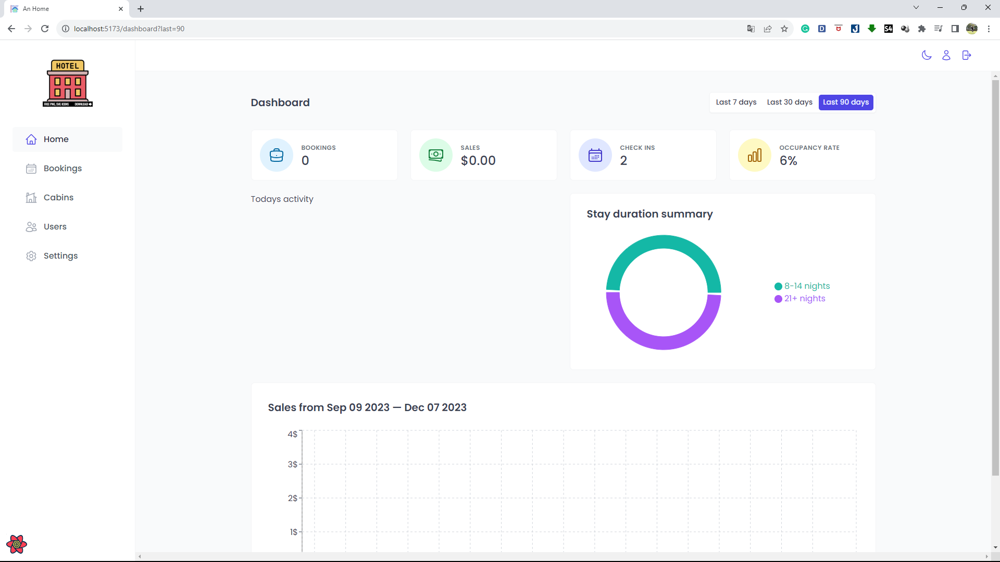
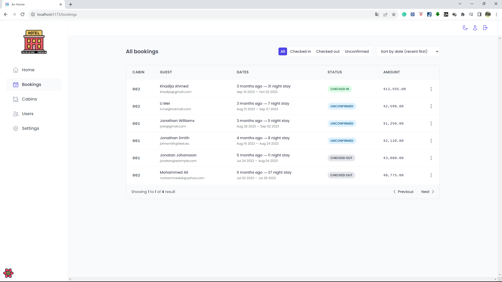
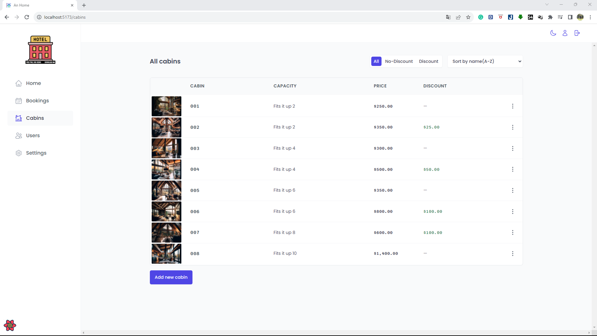
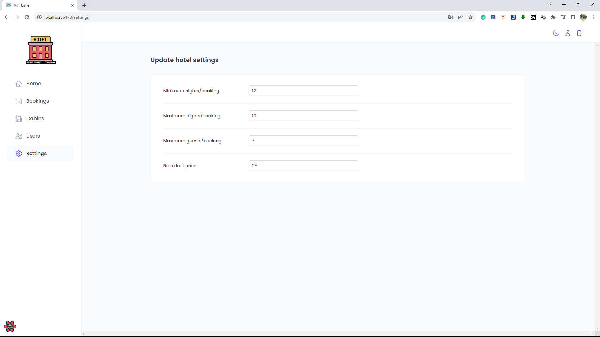

# AN HOME

## Table of Contents

- [Description](#descripton)
- [Feature](#feature)
- [Installation](#installation)
- [Preview](#Preview)

## Description

An intuitive and efficient dashboard designed specifically for homestay employees to seamlessly perform their tasks.

#### Technologies

- React.js (react-query, react-router-dom, react-hot-toast, recharts, styled-components, .....)
- Supabase

## Feature

- Booking Management: Filter bookings by status, allowing employees to easily track and organize reservations. The application also provides the ability to sort bookings by date for better visibility, ensuring efficient management of guest stays. Pagination functionality enables smooth navigation through the booking list.

- Guest Check-in and Checkout: The application facilitates seamless check-in and checkout processes for guests, streamlining the overall guest experience. This feature ensures that employees can efficiently handle the arrival and departure procedures, minimizing any potential delays or confusion.

- Cabin Management (CRUD): The application enables complete management of cabins, allowing employees to create, read, update, and delete cabin information as needed. This feature ensures accurate and up-to-date details for each cabin, providing a comprehensive overview of the available accommodations.

- Statistical Dashboard: The application's dashboard provides insightful statistical information for different time frames, including the last 7, 30, and 90 days. Employees can easily access key performance indicators, such as occupancy rates, revenue, or guest satisfaction metrics. This feature helps in monitoring and analyzing the homestay's performance over time, facilitating data-driven decision-making.

## Installation

- clone project: https://github.com/dinkloc/ui-an-home
- At the root of the project directory, use npm to install the server-side dependencies
  > npm install
- This command installs all the server-side dependencies needed for the game to run locally.
- Use npm to run server
  > npm run dev

## Preview

- Dashboard
  
- Bookings Page
  
- Cabins Page
  
- Setting Page
  
